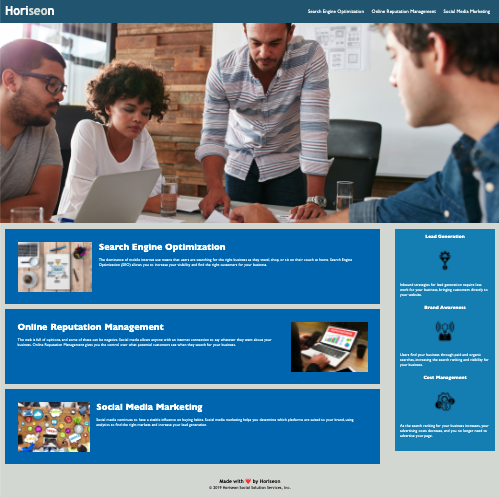

# Project: Horiseon Code Refractoring

## Description
Take a current website deployment and refractor the code to meet accessibility standards and optimize for search engines. Work to consolidate CSS

On the project learning: 
* parsing out different parts of a website 
* identifying HTML containers/sections
* thinking of ways to optimize CSS styling to avoid redundancy 

Challenges:
* figuring out how the CSS affects the HTML
* learning specific best use scenarios for html elements - specifically div, article and section 
* troubleshooting connecting a local git repository to github and deploying git pages

## Built With
* HTML
* CSS
  

## Website
Visit the [project](https://violanerd.github.io/Horiseon/)

## Contribution

Refracted by Madalyne Cross